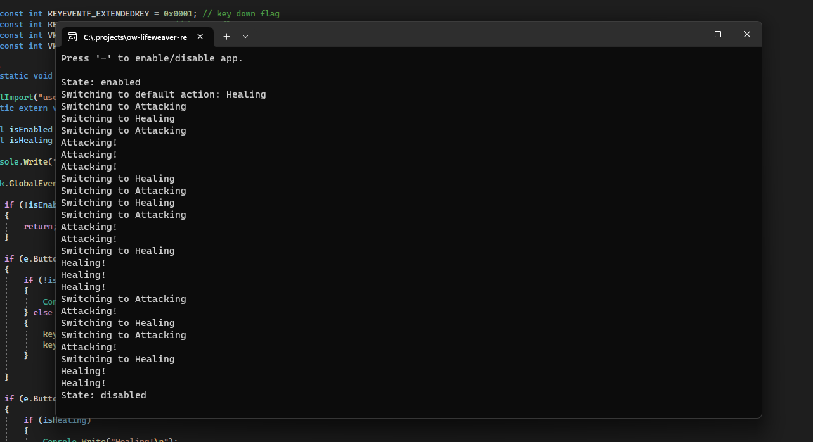

# ow-lifeweaver-rebind
This is an app written in C# that does one simple thing - presses key `2` when you left-click (attack) and key `1` when you right-click (heal) so you don't have to swap between "weapons" using keybindings.

NB! This app **IS NOT** a cheating software -- it only simulates `1` and `2` key presses, but may anyway be considered as cheating by Blizzard. Use it at your own risk.

## Usage
1. Download latest release from [releases page](https://github.com/ucarno/ow-lifeweaver-rebind/releases/latest).
2. Unzip it anywhere and run `ow-lifeweaver-rebind.exe`.

You can disable app's behaviour by pressing `-` key on your numbers row or numpad, so you can easily switch between heroes.
When you re-enable app by pressing `-` again, the default state will be set to `Healing`.

Switching weapons by manually pressing `1` and `2` will also change app's state.

## Binding Settings

### Common

| Name            |      Ability      |                                         Binding(s)                                          |
|-----------------|:-----------------:|:-------------------------------------------------------------------------------------------:|
| Primary fire    |  Attack and Heal  |                    Both `Left Mouse Button` **AND** `Right Mouse Button`                    |
| Secondary fire  |  Petal Platform   | Set to anything you will be comfortable with, I set it to `Middle Mouse Button scroll down` |
| Next weapon     |         -         |                                          _(unset)_                                          |
| Previous weapon |         -         |                                          _(unset)_                                          |
| Ability 1       | Rejuvenating Dash |                                     _(doesn't matter)_                                      |
| Ability 2       |     Life Grip     |                                     _(doesn't matter)_                                      |

### Attack with LMB, Heal with RMB (default)

| Name           | Ability | Binding |
|----------------|:-------:|:-------:|
| Equip weapon 1 |  Heal   |   `1`   |
| Equip weapon 2 | Attack  |   `2`   |

### Attack with RMB, heal with LMB

_NB! You will see wrong messages in app's console window!_

| Name           | Ability | Binding |
|----------------|:-------:|:-------:|
| Equip weapon 1 |  Heal   |   `2`   |
| Equip weapon 2 | Attack  |   `1`   |

## Disclaimer
This app is not affiliated with Blizzard Entertainment, Inc. All trademarks are the properties of their respective owners.

2023 Blizzard Entertainment, Inc. All rights reserved.